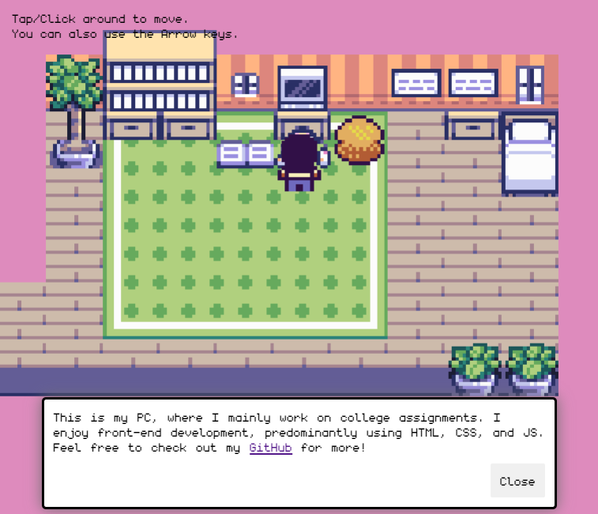

# A simple portfolio as a 2d game
Created this as a small fun project by following JSLegendDev's tutorial on YouTube. 
The project was made using Kaboom js.

# Resources:
YouTube Tutorial : https://www.youtube.com/watch?v=gwtfWORCN0U&ab_channel=JSLegendDev

Tilesets used : https://momen-games.itch.io/happy-la-v2-ts , https://axulart.itch.io/axularts-basic-top-down-interior
